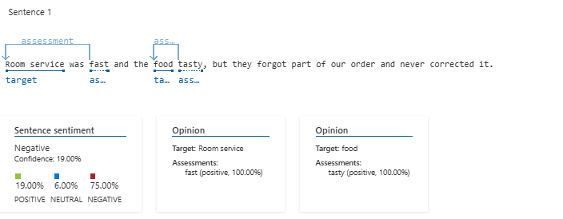

# Análise de Sentimentos com Azure Language Studio

## Visão Geral do Projeto
Este projeto utiliza a ferramenta **Azure Language Studio** para analisar sentenças com diferentes tipos de sentimentos (**positivos, neutros, negativos e mistos**). O objetivo é explorar como a IA da Microsoft interpreta as opiniões expressas em textos.

## Como o Projeto Foi Feito
1. **Criação de um conjunto de sentenças** contendo sentimentos variados.
2. **Upload do texto no Azure Language Studio** para análise.
3. **Coleta dos resultados** gerados pelo Azure, incluindo:
   - Sentimento geral do documento
   - Sentimento de cada sentença
   - Avaliação de entidades específicas dentro do texto
4. **Geração de insights** com base nos resultados obtidos.

## Exemplos de Análises Realizadas
Abaixo estão algumas capturas de tela que demonstram como o Azure interpretou diferentes sentenças:

### 1. Sentença Negativa
- **Frase analisada:** "The elevator was out of service for the entire weekend."
- **Resultado:** Sentimento negativo (100%)

---

### 2. Sentença Positiva
- **Frase analisada:** "They upgraded our room for free!"
- **Resultado:** Sentimento positivo (98%)

---

### 3. Sentença Neutra
- **Frase analisada:** "Room size was average, similar to what you'd expect in a big city."
- **Resultado:** Sentimento neutro (100%)

---

### 4. Sentença Mista
- **Frase analisada:** "Room service was fast and the food tasty, but they forgot part of our order and never corrected it."
- **Resultado:** Sentimento misto, pois algumas partes da frase são positivas ("fast", "tasty"), enquanto outras são negativas ("forgot part of our order").

---

## Insights e Aprendizados
- A IA consegue diferenciar sentimentos dentro de uma mesma frase, fornecendo uma análise detalhada.
- Sentenças claramente positivas ou negativas são identificadas com alta precisão.
- Em frases mistas, o sistema atribui opiniões diferentes para cada parte, o que é útil para análises mais profundas.
- A ferramenta também reconhece entidades dentro do texto e avalia a opinião associada a cada uma delas.

## Possibilidades de Uso
- Análise de feedbacks de clientes.
- Monitoramento de opiniões sobre produtos e serviços.
- Estudo de tendências e opiniões em redes sociais.

## Conclusão
Este projeto demonstrou como o **Azure Language Studio** é capaz de realizar análises precisas de sentimentos. Ele pode ser uma ferramenta poderosa para empresas que desejam compreender melhor a opinião dos clientes e melhorar seus serviços com base em feedbacks automáticos.

---

